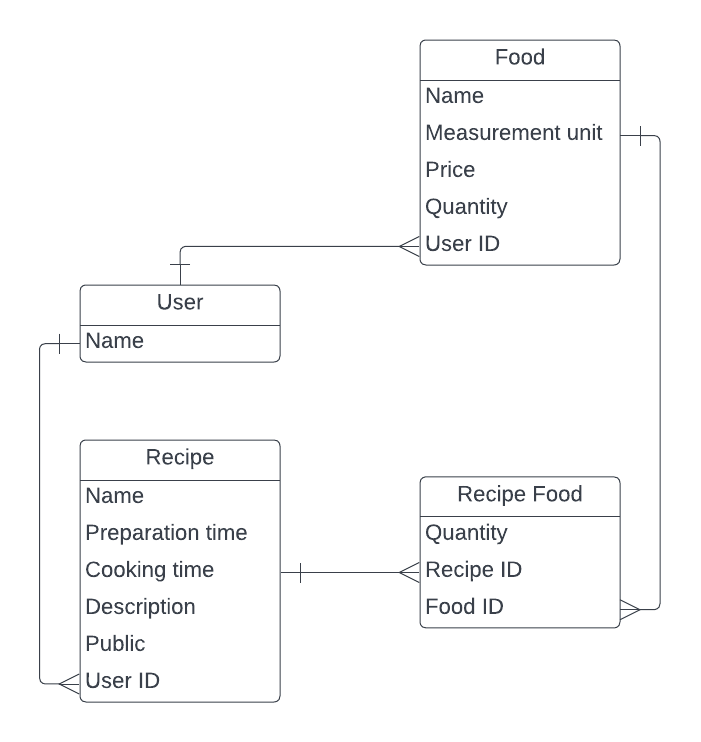

 

   

# Recipe App 🍝🧁🧑‍🍳📲📝

> This repo holds the source code of a Recipe app built with ROR that keeps track of recipes, ingredients, and inventory. It allows users to save ingredients, keep track of their saved information, create recipes, and generate shopping lists based on what they have and what they are missing from a recipe.

## Database ERD Diagram :memo:

## Built With :hammer_and_wrench: 

- **Ruby** Popular programming language that’s used for lots of things, from web app development to data analysis.
- **GitHub flow:**  Correct use of Branches for deployment and features development.
- **Linters Check (Rubocop & Stylelint):** Local and Pull Request check for errors, bugs and stylistic errors in code.
- **PostgreSQL:** A powerful, open source object-relational database system.
- **Rails:** A web application development framework written in the Ruby programming language. This app currently implements version 7.0.4

## Getting Started ➡️

To get a local copy up and running follow these simple steps.:arrow_down:

- Check the Ruby version or if you have at all by running `ruby -v` if it returns  `ruby 3.1.2p20 (2022-04-12 revision 4491bb740a)` or similar, you have Ruby installed.

* Ruby version used `ruby 3.1.2`

### Setup 🛠️

- Clone the repository using the GitHub this link [🔗](https://github.com/karlavdelgadof/Recipe-app.git)
- `cd Recipe-app`
- Run `bundle install`
- Run `rails server`
- Open Browser `http://localhost:3000/`
- Ensure you have PostgreSQL installed before running the application`psql --version`.
- Run `rails db:setup`.
- Create a [.envs](https://medium.com/geekculture/postgresql-rails-and-macos-16248ddcc8ba) file using the link to host postgres credentials.

### Testing

To run tests:
 - Ensure you have `RSpec` installed: running bundle install will install it since it is included in the `Gemfile`.
 - To run a specific test:
 - Run `rspec spec/models<name_of_spec_file>`
 - To run all tests:
 - Run `rspec spec`

## Authors :writing_hand: & Collaborators :busts_in_silhouettes

:woman_technologist:  **Karla Delgado** :writing_hand: 

- GitHub: [@karlavdelgadof](https://github.com/karlavdelgadof)
- Twitter: [@karlavdelgadof](https://twitter.com/karlavdelgadof)
- LinkedIn: [Karla Delgado](https://www.linkedin.com/in/karla-delgado-613a32239/)

## 🤝 Contributing

Contributions, issues, and feature requests are welcome!

Feel free to check the [issues page](../../issues/).

## Show your support

Give a ⭐️ if you like this project!

## Acknowledgments

- Hat tip to anyone whose code was used
- Inspiration
- etc

## 📝 License

This project is [MIT](./MIT.md) licensed.
